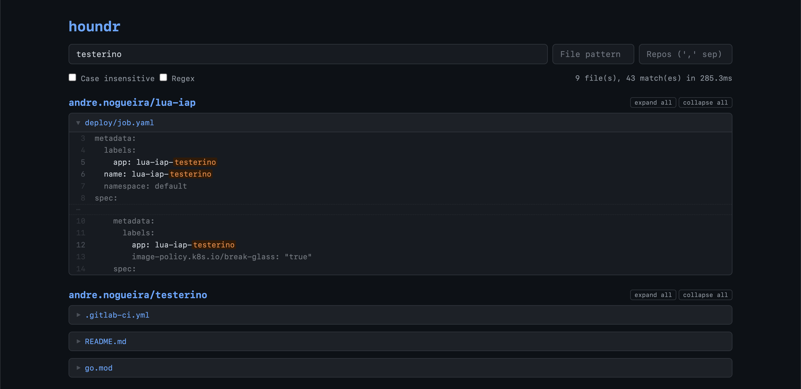

# houndr

[](https://github.com/techquestsdev/houndr/actions)
[](LICENSE)




A fast, trigram-based code search engine for Git repositories - [Hound](https://github.com/hound-search/hound), rewritten in Rust. The name is a portmanteau: **hound** + **Rust** = **houndr**.

houndr clones your repositories, builds trigram indexes, and serves a web UI and JSON API for instant code search across all of them.

## Features

- **Trigram-based search** - sub-millisecond substring and regex search across large codebases
- **Multi-repo** - index and search across multiple Git repositories simultaneously
- **Incremental indexing** - skips re-indexing when HEAD is unchanged, reuses file content from previous indexes via mmap
- **Memory-mapped I/O** - zero-copy index reads for low memory overhead
- **Streaming results** - SSE endpoint streams results per-repo as they complete
- **Private repos** - HTTPS tokens, SSH keys, and env-var references for auth
- **Live status** - UI shows real-time indexing progress on boot
- **Configurable** - CORS origins, request timeout, concurrency limits, file size caps, exclude patterns
- **Library-first** - the index crate is standalone and can power CLI tools or custom integrations

## Quick Start

### Prerequisites

- Rust 1.75+ (2021 edition)
- Git
- A C compiler (for libgit2)

### Build

```sh
cargo build --release
```

### Configure

Copy and edit the config file:

```sh
cp config.toml my-config.toml
```

Add your repositories:

```toml
[server]
bind = "127.0.0.1:6080"

[indexer]
data_dir = "data"

[[repos]]
name = "my-project"
url = "https://github.com/user/my-project.git"
ref = "main"
```

See [`config.toml`](config.toml) for all available options with inline comments.

### Run

```sh
./target/release/houndr-server --config my-config.toml
```

Open [http://127.0.0.1:6080](http://127.0.0.1:6080) in your browser.

### Docker

```sh
docker build -t houndr .
docker run -p 6080:6080 -v ./config.toml:/app/config.toml houndr
```

## API

All endpoints are under `/api/v1/`.

| Method | Path | Description |
|--------|------|-------------|
| `GET` | `/api/v1/search` | Search with JSON response |
| `GET` | `/api/v1/search/stream` | Search with SSE streaming |
| `GET` | `/api/v1/repos` | List indexed repositories |
| `GET` | `/api/v1/status` | Per-repo indexing status |
| `GET` | `/healthz` | Health check |

### Search parameters

| Param | Type | Default | Description |
|-------|------|---------|-------------|
| `q` | string | required | Search query (min 3 characters) |
| `repos` | string | all | Comma-separated repo names to search |
| `files` | string | all | Glob pattern to filter file paths |
| `i` | bool | `false` | Case-insensitive search |
| `regex` | bool | `false` | Treat query as regex |
| `max` | int | `10000` | Max file matches to return per repo. 0 = server default. The response always includes accurate total counts regardless of this limit. |

### Examples

```sh
# Literal search
curl 'http://127.0.0.1:6080/api/v1/search?q=TODO'

# Case-insensitive regex, filtered to Rust files in one repo
curl 'http://127.0.0.1:6080/api/v1/search?q=fn\s+main&regex=true&i=true&files=*.rs&repos=my-project'

# Stream results (SSE)
curl -N 'http://127.0.0.1:6080/api/v1/search/stream?q=TODO'

# Check indexing status
curl 'http://127.0.0.1:6080/api/v1/status'

# List repos with document counts
curl 'http://127.0.0.1:6080/api/v1/repos'
```

## Private Repositories

### HTTPS token

```toml
[[repos]]
name = "private"
url = "https://github.com/org/private.git"
auth_token = "$GITHUB_TOKEN"  # reads from environment
```

### SSH key

```toml
[[repos]]
name = "private"
url = "git@github.com:org/private.git"
ssh_key_path = "~/.ssh/id_ed25519"
ssh_key_passphrase = "$SSH_PASSPHRASE"
```

Auth fields support `$VAR` and `${VAR}` syntax to read values from environment variables.

## Reverse Proxy

houndr is designed to run behind a reverse proxy (nginx, Caddy, etc.) for TLS termination. Example nginx configuration:

```nginx
server {
    listen 443 ssl;
    server_name code.example.com;

    ssl_certificate     /etc/ssl/certs/code.example.com.pem;
    ssl_certificate_key /etc/ssl/private/code.example.com.key;

    location / {
        proxy_pass http://127.0.0.1:6080;
        proxy_set_header Host $host;
        proxy_set_header X-Real-IP $remote_addr;
        proxy_set_header X-Forwarded-For $proxy_add_x_forwarded_for;
        proxy_set_header X-Forwarded-Proto $scheme;

        # Required for SSE streaming
        proxy_buffering off;
        proxy_cache off;
    }
}
```

**Important:** Set `proxy_buffering off` for the SSE streaming endpoint (`/api/v1/search/stream`) to work correctly.

## Health Probes

| Endpoint | Healthy | Unhealthy | Use Case |
|----------|---------|-----------|----------|
| `GET /healthz` | `200` (at least 1 repo indexed) | `503` (no repos indexed yet) | Liveness + readiness |

The health endpoint returns JSON with `status` (`"ready"` or `"initializing"`), `repos_indexed`, and `total_docs`. Use it as both a liveness and readiness probe - the server is functional as soon as the first repo finishes indexing.

## CLI Integration

The `houndr-index` crate is a standalone library with no server or HTTP dependencies. You can build your own CLI tools on top of it:

```rust
use houndr_index::{IndexBuilder, IndexReader};
use houndr_index::writer::write_index;
use houndr_index::query::{QueryPlan, execute_search};

// Build an index
let mut builder = IndexBuilder::new();
builder.add_doc("src/main.rs".into(), content);
let built = builder.build();
write_index(&built, Path::new("index.idx")).unwrap();

// Search an index
let reader = IndexReader::open(Path::new("index.idx"), "repo".into()).unwrap();
let plan = QueryPlan::new("searchTerm", false, false).unwrap();
let result = execute_search(&reader, &plan, 50, None, false);
```

The `houndr-repo` crate can also be used standalone to clone repos and build indexes without running a server - useful for CI pipelines or offline index generation.

## Project Structure

```
crates/
  houndr-index/   Trigram index engine (build, write, read, query)
  houndr-repo/    Git operations, config parsing, indexing pipeline
  houndr-server/  HTTP server, API handlers, web UI
```

See [`docs/architecture.md`](docs/architecture.md) for a detailed architecture overview covering design decisions, optimization techniques, binary index format, and full API specification.

## License

This project is licensed under the [GNU General Public License v3.0](LICENSE).
